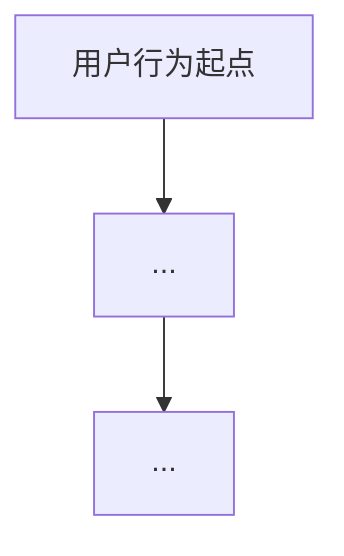
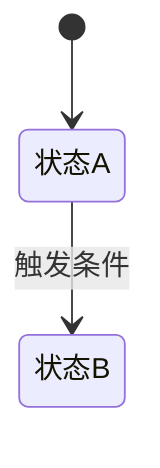

# PRD 模板 — Product Requirements Document

> **使用说明**：此模板由 PM Copilot 在七步讨论法完成后自动填充。
> 各模块内容来源已在括号中标注。

---

# [需求名称] — 产品需求文档（PRD）

**文档版本：** V1.0
**产品模块：** [所属模块]
**影响端侧：** [Web / App / 后台]
**文档状态：** 草稿 / 评审中 / 已确认

---

## 1. 修订记录（Revision History）

| 版本 | 修订日期 | 修订内容 | 修订人 |
|------|---------|---------|--------|
| V1.0 | YYYY-MM-DD | 初版发布 | [PM 姓名] |

---

## 2. 需求背景（Project Background）

### 业务现状与痛点
> 来源：七步法 Step 1 & Step 3

[描述当前存在的问题和用户/业务的痛点]

### 目标与价值
> 来源：七步法 Step 2

[描述该功能希望达到的理想态，以及对业务的价值]

### 核心指标（北极星指标）
> 来源：《标准需求卡片》

[列出 1–2 个最能衡量成功的核心指标，例如：AI 问答准确率 ≥ 90%]

---

## 3. 业务流程与架构（Process & Architecture）

### 业务流程图
> 必须使用 Mermaid 语法，描述用户完成核心任务的闭环路径

### 状态机（如适用）
> 如果是复杂功能，使用 Mermaid 状态图描述对象的状态流转

---

## 4. 功能详情（Functional Specifications）

> **禁止在此模块出现具体的数据库表名或 API 字段名，仅描述业务字段逻辑。**

### 模块 A：[模块名称]

**功能概述：**
[简单描述该模块做什么]

**前置条件：**
[用户在什么状态下能看到/使用此功能]

**交互逻辑：**
[详细描述点击、滑动、反馈等动作的完整交互路径]

**业务规则：**
[核心判断标准，例如：字数限制、Token 截断规则、历史记录保存时效]

**异常流：**

| 异常场景 | 优先级 | 处理方式 |
|---------|--------|---------|
| 无网络 | P0 | [...] |
| 请求超时 | P0 | [...] |
| AI 回复失败 | P1 | [...] |
| [其他 Bad Case] | P2 | [...] |

**AI 策略（仅当本模块涉及 AI 概率性能力时填写）：**

> 若本模块不涉及 AI，删除此节。

- **输入输出边界：** AI 需要接收的核心字段 / 最大 Token 限制
- **模型与 Prompt 策略：** 依赖模型版本 / 核心 Prompt 或 RAG 策略思路
- **评测与验收标准：** [例如：基于 50 条测试集，准确率 ≥ 90%]
- **降级与兜底机制：**

| 异常场景 | 兜底处理逻辑 | 前端展示文案 |
|---------|------------|------------|
| AI 接口超时 | [处理逻辑] | [展示文案] |
| 触发安全拦截 | [处理逻辑] | [展示文案] |
| 生成乱码/幻觉 | [处理逻辑] | [展示文案] |

---

### 模块 B：[模块名称]

**功能概述：**
[...]

**前置条件：**
[...]

**交互逻辑：**
[...]

**业务规则：**
[...]

**异常流：**

| 异常场景 | 优先级 | 处理方式 |
|---------|--------|---------|
| [...] | P0 | [...] |

---

## 5. 验收标准（Definition of Done）

> 来源：七步法 Step 7

以下条件全部满足，视为需求交付完成：

- [ ] [验收条件 1，例如：用户可在 Web 端正常发起多轮对话]
- [ ] [验收条件 2，例如：AI 问答准确率在测试集上 ≥ 90%]
- [ ] [验收条件 3，例如：所有 P0 异常流均有兜底处理]

---

## 6. 数据埋点与非功能需求（Metrics & Non-Functional）

### 核心埋点事件

| 事件名 | 触发时机 | 采集字段 |
|--------|---------|---------|
| [事件名] | [何时触发] | [字段] |

### 性能要求
[例如：AI 问答首字响应时间 ≤ 2s]

### 安全与合规要求
[例如：敏感词过滤、数据脱敏要求]
